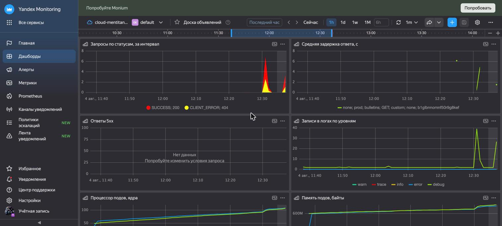
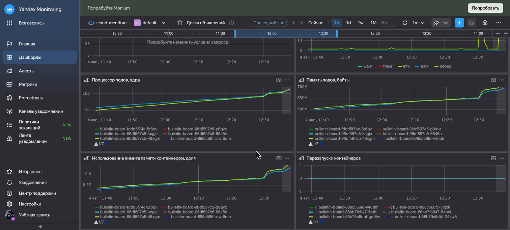
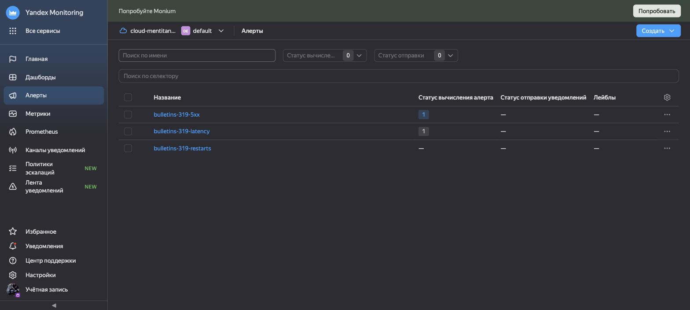

### Hexlet tests and linter status:
[](https://github.com/titanmen1/devops-engineer-from-scratch-project-319/actions)

# Доска объявлений в Managed Kubernetes

Приложение «доска объявлений» разворачивается в Yandex Managed Service for
Kubernetes. Вся инфраструктура описана в Terraform и поднимается с нуля одной
командой: сеть, кластер, управляемый PostgreSQL, Object Storage и Lockbox для
секретов.

Исходный код приложения: [titanmen1/project-devops-deploy](https://github.com/titanmen1/project-devops-deploy).
Образ собирается в CI и публикуется в GitHub Container Registry:
`ghcr.io/titanmen1/project-devops-deploy:latest`.

Pull request'ы в этот репозиторий не принимаются — это учебный проект.

## Схема инфраструктуры

```text
Yandex Cloud, зона ru-central1-d
│
├── VPC bulletins-319-net (10.20.0.0/16)
│   ├── NAT-шлюз + таблица маршрутизации — выход узлов в интернет
│   ├── security group bulletins-319-k8s-sg — мастер и узлы
│   └── security group bulletins-319-db-sg — только порт 6432 из кластера
│
├── Managed Kubernetes bulletins-319-k8s (зональный мастер, публичный API)
│   └── группа узлов bulletins-319-ng — 2 узла, 2 vCPU × 20%, 4 ГБ
│       ├── ingress-nginx → публичный адрес 158.160.197.20
│       └── namespace bulletins: Deployment, Service, Ingress, PDB, HPA
│
├── Managed PostgreSQL bulletins-319-pg (b2.medium, доступен только из кластера)
├── Object Storage bulletins-319-media — картинки объявлений
├── Object Storage bulletins-319-tfstate — состояние Terraform
└── Lockbox bulletins-319-app-secrets — доступы к базе и хранилищу
```

## Требования к рабочей машине

| Инструмент | Версия | Зачем |
|---|---|---|
| [Yandex Cloud CLI](https://yandex.cloud/ru/docs/cli/quickstart#install) | 1.22+ | аутентификация в облаке, kubeconfig, bootstrap состояния |
| [Terraform](https://developer.hashicorp.com/terraform/install) | 1.6+ | инфраструктура |
| [kubectl](https://kubernetes.io/docs/tasks/tools/) | 1.32+ | работа с кластером |
| Docker | 24+ | локальный прогон приложения |
| GNU Make | — | все команды репозитория |
| Python 3 | 3.9+ | разбор JSON в bootstrap-скрипте |

Проверка:

```bash
yc version && terraform version && kubectl version --client
```

Нужен сервисный аккаунт Yandex Cloud с ролью `admin` в каталоге и настроенный
профиль `yc` (`yc init`). Все команды `make tf-*` сами берут `cloud-id` и
`folder-id` из профиля и запрашивают свежий IAM-токен.

## Развёртывание инфраструктуры

```bash
make tf-bootstrap   # сервисный аккаунт, ключ и бакет для состояния Terraform
make tf-init        # инициализация с backend в Object Storage
make tf-plan        # проверка плана
make tf-apply       # создание инфраструктуры (15–20 минут)
make kubeconfig     # доступ к кластеру
```

## Выкат приложения

```bash
make k8s-secret     # секрет приложения из выводов Terraform
make k8s-apply      # namespace, ConfigMap, Deployment, Service
make k8s-rollout    # дождаться готовности подов
make k8s-status     # что получилось
```

Приложение живёт в namespace `bulletins`. Конфигурация разложена по двум
объектам: несекретные параметры — в ConfigMap `bulletin-config`, доступы к базе
и Object Storage — в Secret `bulletin-secret`. Секрет собирается из выводов
Terraform командой `make k8s-secret` и в репозиторий не попадает; образец полей
лежит в [k8s/secret.example.yaml](k8s/secret.example.yaml).

Проверить приложение без внешнего доступа:

```bash
make k8s-forward
curl http://localhost:8080/api/bulletins
```

Порт 8080 отдаёт приложение, 9090 — Actuator. Probes ходят именно в 9090:
`/actuator/health/readiness` и `/actuator/health/liveness`. Пока Spring Boot
стартует (около 30 секунд), под держит startupProbe, поэтому liveness не
перезапускает его на старте.

## Внешний доступ

Наружу трафик отдаёт ingress-nginx: контроллер получает публичный адрес через
сетевой балансировщик Yandex Cloud. Адрес зарезервирован в Terraform
(`yandex_vpc_address`), поэтому переживает пересоздание сервиса.

```bash
make ingress-install   # контроллер занимает зарезервированный адрес
make ingress-ip        # какой это адрес
make smoke             # проверка приложения снаружи
```

Приложение доступно по адресу **http://158.160.197.20**.

Правило Ingress описано без `host`, поэтому принимает запросы и по адресу, и по
доменному имени, если его позже привяжут к этому адресу.

## Масштабирование и релизы без простоя

Кластер держит два рабочих узла (`node_count` в *terraform/variables.tf*),
приложение — две реплики. За безостановочность отвечают четыре вещи:

| Что | Где | Зачем |
|---|---|---|
| `maxUnavailable: 0`, `maxSurge: 1` | Deployment | во время выката всегда есть полный набор рабочих подов |
| `preStop: sleep 10` | Deployment | под успевает уйти из endpoints до остановки |
| `topologySpreadConstraints` | Deployment | реплики стоят на разных узлах |
| PodDisruptionBudget | *50-pdb.yaml* | при сливе узла остаётся минимум одна реплика |

`matchLabelKeys: [pod-template-hash]` в правиле разноса считает перекос только
среди подов текущей ревизии. Без него в расчёт попадают ещё живые поды старой
ревизии, и обе новые реплики законно уезжают на один узел.

HorizontalPodAutoscaler (*60-hpa.yaml*) держит от 2 до 4 реплик по загрузке
процессора (порог 70%). Metrics Server в Managed Kubernetes работает из
коробки, ставить ничего не нужно.

Проверка выката под нагрузкой:

```bash
# в одном терминале — непрерывные запросы
while true; do curl -s -o /dev/null -w '%{http_code}\n' http://158.160.197.20/api/bulletins; sleep 0.3; done

# в другом — смена версии образа
kubectl -n bulletins set image deployment/bulletin-board \
  app=ghcr.io/titanmen1/project-devops-deploy:main-36200c4
kubectl -n bulletins rollout status deployment/bulletin-board
```

На таком прогоне выката (566 запросов за два переключения версии) все ответы
были `200`, ошибок и обрывов соединения не было.

Откат на предыдущую версию:

```bash
kubectl -n bulletins rollout undo deployment/bulletin-board
```

## Наблюдаемость

Метрики и логи уезжают в управляемые сервисы Yandex Cloud — отдельный стенд с
Prometheus и Grafana не поднимается.

### Логи

Логи подов собирает fluent-bit (DaemonSet в namespace `logging`) с плагином
Yandex Cloud Logging и складывает в лог-группу `bulletins-319-logs`. Срок
хранения — 7 суток (`logs_retention_period` в *terraform/variables.tf*).
Собираются только логи namespace `bulletins`: фильтр задан маской файлов
`/var/log/containers/*_bulletins_*.log`.

```bash
make logging-install   # DaemonSet + идентификатор лог-группы из Terraform
make logs-cloud        # последние 20 записей из Cloud Logging
```

Авторизации по ключам нет: агент представляется сервисным аккаунтом узла,
которому в *terraform/kubernetes.tf* выдана роль `logging.writer`.

Приложение пишет структурированный JSON, поэтому в fluent-bit включён
`Merge_Log` — поля `message` и `level` попадают в Cloud Logging как есть.
Указывать `Merge_Log_Key` при этом нельзя: из вложенного объекта плагин
сообщение не достаёт, и записи приезжают с пустым текстом.

### Метрики

| Что | Откуда | Сервис в Monitoring |
|---|---|---|
| Процессор, память, перезапуски подов | собирает сам Managed Kubernetes | `managed-kubernetes` |
| HTTP-запросы, задержки, JVM, логи по уровням | sidecar Unified Agent в поде приложения | `custom`, префикс `bulletins.` |

```bash
make monitoring-install   # ConfigMap с конфигом агента и выкат sidecar
```

Агент ездит sidecar-контейнером, а не отдельным Deployment: иначе он опрашивал
бы приложение через Service, и метрики двух реплик перемешивались бы. Метки
`pod` и `node` на метрики вешает само приложение через
`MANAGEMENT_METRICS_TAGS_*` — Micrometer добавляет их ко всем сериям.

Две вещи, на которые ушло время и которые стоит помнить:

- В Monitoring метка `name` зарезервирована под имя метрики. Группы
  `executor_*` и `jdbc_connections_*` используют её в своих данных, из-за чего
  агент отбраковывал **весь** батч. Обе группы выключены в ConfigMap
  приложения.
- Unified Agent отдаёт счётчики Prometheus уже дельтами за интервал сбора,
  поэтому `rate()` в запросах не нужен — с ним графики остаются пустыми.

### Дашборд

Дашборд `bulletins-319-dashboard` описан в *terraform/observability.tf* и
создаётся вместе с инфраструктурой. Открыть:
[Yandex Monitoring → Дашборды → Доска объявлений](https://monitoring.yandex.cloud/folders/b1glbnnomnf50r9g8kef/dashboards/bulletins-319-dashboard).

Восемь графиков: запросы по статусам, средняя задержка, ответы 5xx, записи в
логах по уровням, процессор и память подов, использование лимита памяти,
перезапуски контейнеров.





### Алерты

Terraform-ресурса и публичного API для алертов у Monitoring нет, поэтому они
заведены в консоли. Параметры для воспроизведения:

| Алерт | Запрос | Агрегация | Warning | Alarm |
|---|---|---|---|---|
| `bulletins-319-5xx` | `series_sum("bulletins.http_server_requests_seconds_count"{service="custom", application="bulletins", status="5*"})` | Сумма | 1 | 10 |
| `bulletins-319-latency` | `series_sum("bulletins.http_server_requests_seconds_sum"{…}) / series_sum("bulletins.http_server_requests_seconds_count"{…})` | Среднее | 0.5 | 1 |
| `bulletins-319-restarts` | `series_sum("container.restart_count"{service="managed-kubernetes", namespace="bulletins"})` | Максимум | 3 | 5 |

Во всех трёх окно вычисления 5 минут, задержка 30 секунд, сравнение «Больше».



## Terraform

Конфигурация лежит в *terraform/* и разбита по смыслу:

| Файл | Что описывает |
|---|---|
| `versions.tf` | версии Terraform и провайдеров |
| `providers.tf` | провайдер Yandex Cloud и способ аутентификации |
| `backend.tf` | хранение состояния в Object Storage |
| `variables.tf` | все параметры инфраструктуры |
| `locals.tf` | строка подключения к базе и параметры S3 |
| `network.tf` | сеть, подсеть, NAT, security groups, публичный адрес |
| `kubernetes.tf` | сервисные аккаунты, кластер, группа узлов |
| `database.tf` | Managed PostgreSQL, база и пользователь |
| `storage.tf` | бакет для картинок и ключи доступа к нему |
| `lockbox.tf` | секрет с доступами приложения |
| `observability.tf` | лог-группа Cloud Logging и дашборд Monitoring |
| `outputs.tf` | адреса и идентификаторы для следующих шагов |

Состояние хранится в бакете `bulletins-319-tfstate` с включённым
версионированием — в нём открытым текстом лежат пароль базы и ключи сервисных
аккаунтов, поэтому в репозиторий оно не попадает. Бакет и ключи доступа к нему
заводит `make tf-bootstrap`: сам бакет описать в Terraform нельзя, он нужен
раньше первого apply. Ключи складываются в `terraform/.backend-credentials` —
файл в `.gitignore`.

Полезные выводы:

```bash
make tf-output                                  # всё разом
terraform -chdir=terraform output -raw db_url   # строка подключения к базе
terraform -chdir=terraform output -raw lockbox_secret_id
```

## Локальный запуск приложения

Тот же образ, что едет в кластер, поднимается локально вместе с PostgreSQL и
MinIO вместо Object Storage:

```bash
docker compose up -d
curl http://localhost:8080/api/bulletins
curl http://localhost:9090/actuator/health
docker compose down -v
```

## Проверки

```bash
make lint   # terraform fmt -check + tflint
make test   # terraform init -backend=false + terraform validate
```

## Структура репозитория

```text
.
├── assets/                      # скриншоты дашборда и алертов
├── bin/tf-bootstrap.sh          # разовая подготовка бакета для состояния
├── k8s/
│   ├── manifests/               # namespace, ConfigMap, Deployment, Service,
│   │                            # PDB, HPA, Ingress
│   ├── logging/                 # fluent-bit для Cloud Logging
│   ├── monitoring/              # конфиг Unified Agent для метрик
│   ├── ingress-nginx-values.yaml # values для чарта ingress-контроллера
│   └── secret.example.yaml      # образец секрета, реальные значения не в git
├── terraform/                   # инфраструктура Yandex Cloud
├── docker-compose.yaml          # локальный прогон приложения
├── Makefile                     # все команды проекта
└── README.md
```
